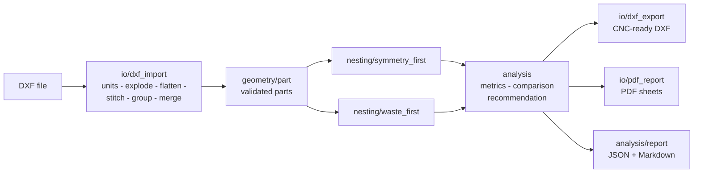

# dxf-nesting-optimizer

[](https://github.com/Izz-Badarin/dxf-nesting-optimizer/actions/workflows/ci.yml)
[](https://www.python.org)
[](LICENSE)

**Dual-strategy DXF nesting optimizer with comparative analysis for CNC sheet cutting.**

It imports DXF files, nests the parts onto sheets (default **1220 × 2440 mm**) with
**two opposing strategies — symmetry-first and waste-minimization — runs both, and
produces a side-by-side comparison with a recommendation**: material utilization,
waste, sheet-replication efficiency and CNC handling factors.

> **Status: v0.1.0 in active development.** The DXF import pipeline and
> `dxfnest info` inspection command are functional (milestones M0–M2).
> Nesting + export + reports land with M3–M6. See the [roadmap](#roadmap).

## Why another nesting tool?

Commercial nesters (ArtCAM, OptiNest, Cabinet Vision) each optimize a single
objective. This project takes the best part of each of them — ArtCAM's practical
shop-floor model, OptiNest's multi-pass true-shape optimizer, Cabinet Vision's
production workflow — and adds the piece none of them has: **an automatic
dual-strategy comparison**, so you can *see* whether a mirrored, repeating
pattern or a pure waste-minimizing scramble is the better choice for your job.

| Source | What we took |
|---|---|
| ArtCAM 2018 | tool Ø / clearance / edge-clearance spacing model, rotation step angle, mirror toggle, curve tolerance, identical-sheet merging ("Sheet 1 (3 copies)"), leftover-material (offcut) export |
| OptiNest | multi-strategy true-shape engine: heuristic placement + refinement pass with a "calculation depth" budget, part grouping, kerf handling |
| Cabinet Vision | production workflow thinking: part metadata/labels, grain-direction control, machine-ready output |
| This project | **dual-strategy nesting, comparison metrics, recommendation engine, open-source & headless** |

## Features

| Capability | Status |
|---|---|
| DXF import (R12–R2018, damaged-file recovery) | ✅ working |
| Unit detection from `$INSUNITS` (+ override) | ✅ working |
| INSERT/block explosion, curve flattening (arcs, splines, ellipses, bulges) | ✅ working |
| Open line/arc chain stitching into closed contours | ✅ working |
| Part detection: blocks → closed contours, holes/islands via even-odd containment | ✅ working |
| Identical-part merging with quantities | ✅ working |
| `dxfnest info` inspection command | ✅ working |
| Waste-first nesting engine + DXF export | 🔜 M3 |
| Symmetry-first nesting engine | 🔜 M4 |
| Comparison metrics, reports (JSON/Markdown), PDF visualization | 🔜 M5 |
| True-shape NFP engine, free rotation, SA refinement, part-in-part | 🔜 v0.2+ (fusion phase 2) |

## Installation

Requires Python 3.10+.

```bash
git clone https://github.com/Izz-Badarin/dxf-nesting-optimizer.git
cd dxf-nesting-optimizer
python -m venv .venv && source .venv/bin/activate
pip install -e .            # runtime
pip install -e ".[dev]"     # + development tools
```

See [docs/installation.md](docs/installation.md) for details.

## Quickstart

Inspect a DXF job — parts, quantities, holes, warnings:

```bash
dxfnest info examples/inputs/furniture_parts.dxf
```

```
DXF       : examples/inputs/furniture_parts.dxf
Version   : AC1027
Unit      : millimeters (x1 to mm)
Parts     : 5 unique / 18 total

ID    Name                 Layer       Qty  W x H (mm)    Area (mm2)  Holes
----------------------------------------------------------------------------------
P001  SIDE_PANEL           PANEL         4  600 x 800       479,687      4
P002  SHELF                SHELF         6  580 x 500       290,000      0
...
```

Nesting (arrives with milestone M3):

```bash
dxfnest nest examples/inputs/furniture_parts.dxf -o out/ --strategy both --pdf
```

## The two strategies

* **Symmetry-first** — arranges parts in mirrored or repeated tile patterns across
  the sheet, prioritizing pattern regularity (easier operator loading, repeatable
  sheets) even at the cost of extra waste.
* **Waste-minimization** — arranges parts purely to minimize unused sheet area.

Both run on every job; the comparison report shows utilization, waste,
sheet-replication efficiency and CNC handling factors for each, then recommends
the more effective approach. Metric definitions: [docs/metrics.md](docs/metrics.md).

## Architecture



Module map and design notes: [docs/architecture.md](docs/architecture.md).

## Examples

[`examples/inputs/`](examples/inputs) contains three generated sample jobs:

* `furniture_parts.dxf` — cabinet job: block-based side panels (qty 4), shelves,
  doors with rounded tops, drawer fronts. Demonstrates INSERT parts, holes and
  part merging.
* `mixed_curved.dxf` — rings, ellipses, line/arc chains, a gear with holes, a
  mirrored pair.
* `stress_many_parts.dxf` — 400 mixed parts for performance testing.

Regenerate them with `python examples/generate.py`.

## Roadmap

| Phase | Content | Status |
|---|---|---|
| 1 — Core (v0.1.0) | import → dual nesting → DXF export → comparison report → PDF; sheet merging, offcut export, rotation step, grain flag, labels | 🚧 M0–M2 done, M3–M6 next |
| 2 — OptiNest-grade optimizer (v0.2+) | NFP true-shape, free rotation, SA refinement (calculation depth), part-in-part, smoothing | planned |
| 3 — Production workflow (v0.5+) | batch jobs, offcut inventory, barcode labels, G-code post-processors, common-line cutting | planned |
| 4 — Fusion GUI (v1.0) | web UI with side-by-side strategy comparison and manual adjust/re-nest | planned |

## Contributing

Issues and pull requests are welcome — see [CONTRIBUTING.md](CONTRIBUTING.md).

## License

[MIT](LICENSE)
