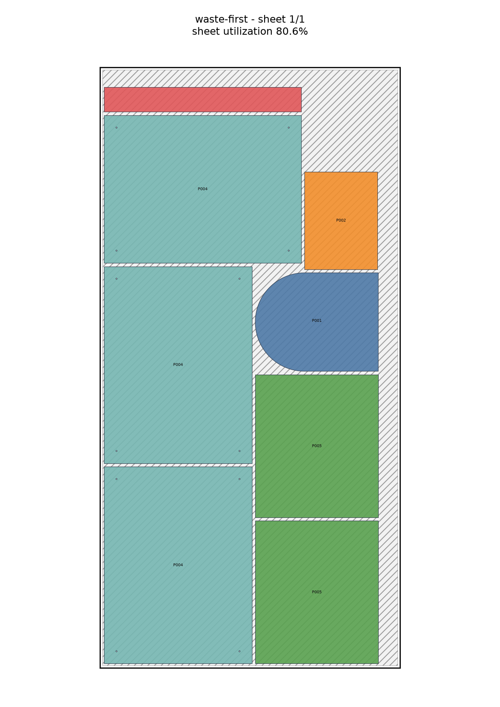
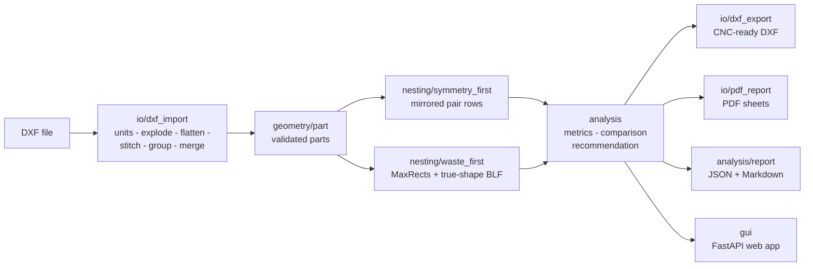

# dxf-nesting-optimizer

[](https://github.com/Izz-Badarin/dxf-nesting-optimizer/actions/workflows/ci.yml)
[](https://www.python.org)
[](LICENSE)

**Dual-strategy DXF nesting optimizer with comparative analysis for CNC sheet cutting.**

It imports DXF files, nests the parts onto sheets (default **1220 × 2440 mm**) with
**two opposing strategies — symmetry-first and waste-minimization — runs both, and
produces a side-by-side comparison with a recommendation**: material utilization,
waste, sheet-replication efficiency and CNC handling factors.

**v0.1.0 is feature-complete:** DXF import → dual nesting → DXF export →
comparison reports → PDF → **web GUI**.

## Why another nesting tool?

Commercial nesters (ArtCAM, OptiNest, Cabinet Vision) each optimize a single
objective. This project takes the best part of each of them — ArtCAM's practical
shop-floor model, OptiNest's multi-pass true-shape optimizer, Cabinet Vision's
production workflow — and adds the piece none of them has: **an automatic
dual-strategy comparison**, so you can *see* whether a mirrored, repeating
pattern or a pure waste-minimizing scramble is the better choice for your job.

| Source | What we took |
|---|---|
| ArtCAM 2018 | tool Ø / clearance / edge-clearance spacing model, rotation step angle, mirror toggle, curve tolerance, identical-sheet merging ("Sheet 1 (3 copies)"), leftover-material (offcut) export |
| OptiNest | multi-strategy true-shape engine: heuristic placement + refinement with a "calculation depth" budget, part grouping, kerf handling |
| Cabinet Vision | production workflow thinking: part metadata/labels, grain-direction control, machine-ready output |
| This project | **dual-strategy nesting, comparison metrics, recommendation engine, open-source & headless** |

## Features

| Capability | Status |
|---|---|
| DXF import (R12–R2018, damaged-file recovery, `$INSUNITS` detection) | ✅ |
| INSERT block explosion, curve flattening (arcs, splines, ellipses, bulges) | ✅ |
| Open line/arc chain stitching into closed contours | ✅ |
| Part detection: blocks → closed contours, holes/islands via even-odd containment | ✅ |
| Identical-part merging with quantities | ✅ |
| **Waste-first nesting** (MaxRects best-area/short-side + true-shape bottom-left-fill, multi-sheet, best-of-N) | ✅ |
| **Symmetry-first nesting** (mirrored pair rows, butterfly patterns, identical sheets) | ✅ |
| CNC-ready DXF export (CUT / ETCH / OFFCUT / CNC_BOUNDARY layers, identical-sheet merging) | ✅ |
| Comparison metrics: utilization, waste, replication, cut length, pierces, rapid travel, clamping factors | ✅ |
| Recommendation engine with rationale | ✅ |
| Reports: JSON + Markdown | ✅ |
| PDF visualization (summary + per-sheet pages) | ✅ |
| **Web GUI** (drag-drop, side-by-side sheets, downloads) | ✅ |
| True-shape NFP engine, free rotation, SA refinement, part-in-part | 🔜 v0.2+ (fusion phase 2) |
| Batch jobs, offcut inventory, barcode labels, G-code post-processors | 🔜 phase 3 |

## Installation

Requires Python 3.10+.

```bash
git clone https://github.com/Izz-Badarin/dxf-nesting-optimizer.git
cd dxf-nesting-optimizer
python -m venv .venv && source .venv/bin/activate
pip install -e .            # runtime
pip install -e ".[gui]"     # + web GUI
pip install -e ".[dev]"     # + development tools
```

## Quickstart

Inspect a DXF job:

```bash
dxfnest info examples/inputs/furniture_parts.dxf
```

Nest with both strategies, export DXFs, reports and PDF:

```bash
dxfnest nest examples/inputs/furniture_parts.dxf -o out/ --pdf
```

```
Imported : 5 unique parts / 18 total (4,656,978 mm2)

symmetry-first   sheets=3  placed=18  unplaced=0  runtime=0.01s
waste-first      sheets=2  placed=18  unplaced=0  runtime=0.04s

Metric                          symmetry-first       waste-first
Material utilization                     52.1%             78.2%
Waste                                    47.9%             21.8%
Sheets used                                  3                 2
Sheet replication efficiency              0.00              0.00
...

Recommendation: waste-first
  - waste-first needs 1 fewer sheet(s)
  - waste-first achieves 26.1 points higher utilization
```

Launch the web GUI:

```bash
dxfnest gui            # http://127.0.0.1:8000
```



*Waste-first layout for the furniture example, rendered from the exported PDF.*

## The two strategies

* **Symmetry-first** — arranges parts in mirrored or repeated tile patterns
  across the sheet, prioritizing pattern regularity (repeatable sheets,
  operator-friendly loading) even at the cost of extra waste.
* **Waste-minimization** — arranges parts purely to minimize unused sheet area.

Both run on every job; the comparison report shows utilization, waste,
sheet-replication efficiency and CNC handling factors for each, then recommends
the more effective approach with a rationale. Metric definitions:
[docs/metrics.md](docs/metrics.md).

## The web GUI

```bash
pip install -e ".[gui]"
dxfnest gui --host 0.0.0.0 --port 8000
```

* Drop any DXF (or load a bundled example) and configure sheet, tooling,
  clearance, rotation and mirroring
* Run both strategies with one click
* Side-by-side, to-scale sheet visualization with per-part tooltips and labels
* Full metric comparison table plus the recommendation with rationale
* Download the nested DXFs, the JSON/Markdown reports and the PDF

## Architecture



Module map and design notes: [docs/architecture.md](docs/architecture.md).
Performance: the 400-part stress example imports in ~0.4 s and nests in ~0.6 s.

## Examples

[`examples/inputs/`](examples/inputs) — four generated sample jobs;
[`examples/outputs/`](examples/outputs) — committed results of `dxfnest nest`:

| Job | Parts | Demonstrates |
|---|---|---|
| `furniture_parts.dxf` | 5 unique / 18 | INSERT blocks, holes, text metadata, merging |
| `mixed_curved.dxf` | 7 unique / 10 | chain stitching, curved entities, mirror pairs |
| `repeating_batch.dxf` | 3 unique / 76 | repeating production batch — replication trade-off (symmetry-first 0.20 vs waste-first 0.00) |
| `stress_many_parts.dxf` | 400 parts | performance |

Regenerate inputs with `python examples/generate.py`.

## Roadmap

| Phase | Content | Status |
|---|---|---|
| 1 — Core (v0.1.0) | import → dual nesting → DXF export → comparison report → PDF → GUI; sheet merging, offcut export, rotation step, grain flag, labels | ✅ done |
| 2 — OptiNest-grade optimizer (v0.2+) | NFP true-shape, free rotation, SA refinement (calculation depth), part-in-part, smoothing | planned |
| 3 — Production workflow (v0.5+) | batch jobs, offcut inventory, barcode labels, G-code post-processors, common-line cutting | planned |
| 4 — Fusion GUI+ (v1.0) | manual adjust & re-nest, dynamic nesting, project save | planned |

## Contributing

Issues and pull requests are welcome — see [CONTRIBUTING.md](CONTRIBUTING.md).

## License

[MIT](LICENSE)
